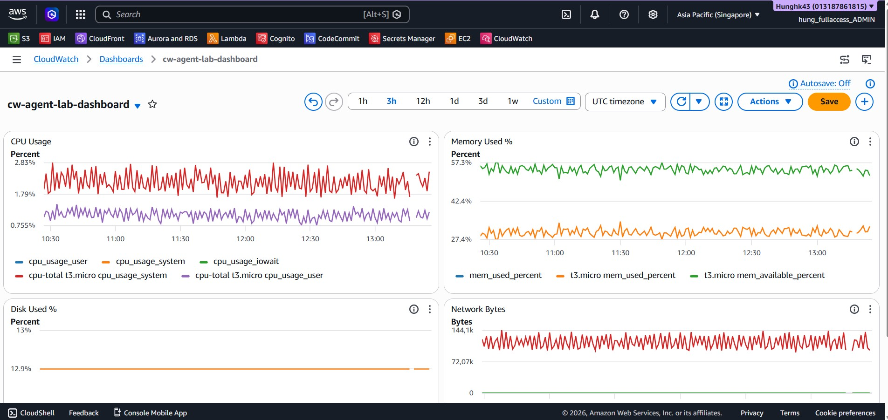

# Installing CloudWatch Agent on EC2


---

## Dùng lệnh sau

```bash
cd terraform
terraform init
terraform plan
terraform apply
```

Terraform sẽ tự tạo:
- IAM Role + `CloudWatchAgentServerPolicy` đính kèm
- EC2 Instance (Amazon Linux 2023)
- Cài & khởi động CloudWatch Agent qua `user_data`
- CloudWatch Log Groups + Dashboard + Alarm CPU > 80%

Sau khi apply, connect vào EC2:
```bash
# Lệnh này có trong terraform output
aws ssm start-session --target <instance_id> --region ap-southeast-1
```

---

## Cách thủ công 

### Prerequisite
EC2 IAM Role phải đính kèm policy: **CloudWatchAgentServerPolicy**

### Cách 1: Chạy script tự động (có wizard)
```bash
chmod +x setup-cloudwatch-agent.sh
./setup-cloudwatch-agent.sh
```

## Cách 2: Dùng config file sẵn (không cần wizard)
```bash
chmod +x apply-config-without-wizard.sh
./apply-config-without-wizard.sh
```

---

## Các bước thủ công 

### 1. Install Agent
```bash
# Amazon Linux / RHEL
sudo yum install amazon-cloudwatch-agent -y

# Ubuntu / Debian
sudo apt-get install amazon-cloudwatch-agent
```

### 2. Run Configuration Wizard
```bash
sudo /opt/aws/amazon-cloudwatch-agent/bin/amazon-cloudwatch-agent-config-wizard
```

### 3. Start the Agent
```bash
sudo systemctl enable amazon-cloudwatch-agent
sudo systemctl start amazon-cloudwatch-agent
```

### 4. Verify & Check Status
```bash
sudo /opt/aws/amazon-cloudwatch-agent/bin/amazon-cloudwatch-agent-ctl -m ec2 -a status
```

---

## Metrics được thu thập (cloudwatch-agent-config.json)
| Loại | Metrics |
|------|---------|
| CPU  | idle, iowait, user, system |
| Disk | used_percent, inodes_free |
| Memory | used_percent, available_percent |
| Network | bytes_sent/recv, packets_sent/recv |

Logs được đẩy lên CloudWatch Log Groups: `/ec2/system/messages`, `/ec2/system/syslog`
###  Ảnh minh chứng Cloudwatch chạy trên EC2

